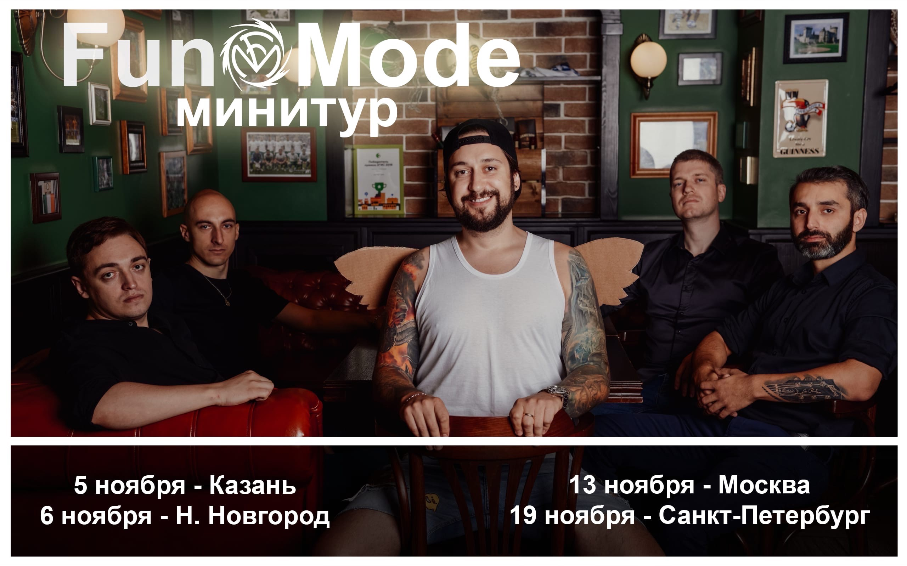
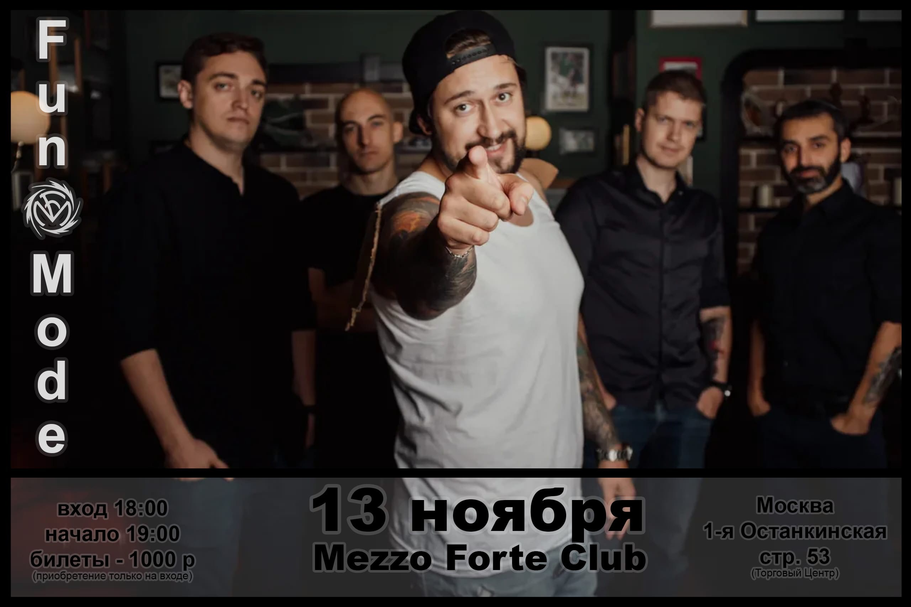
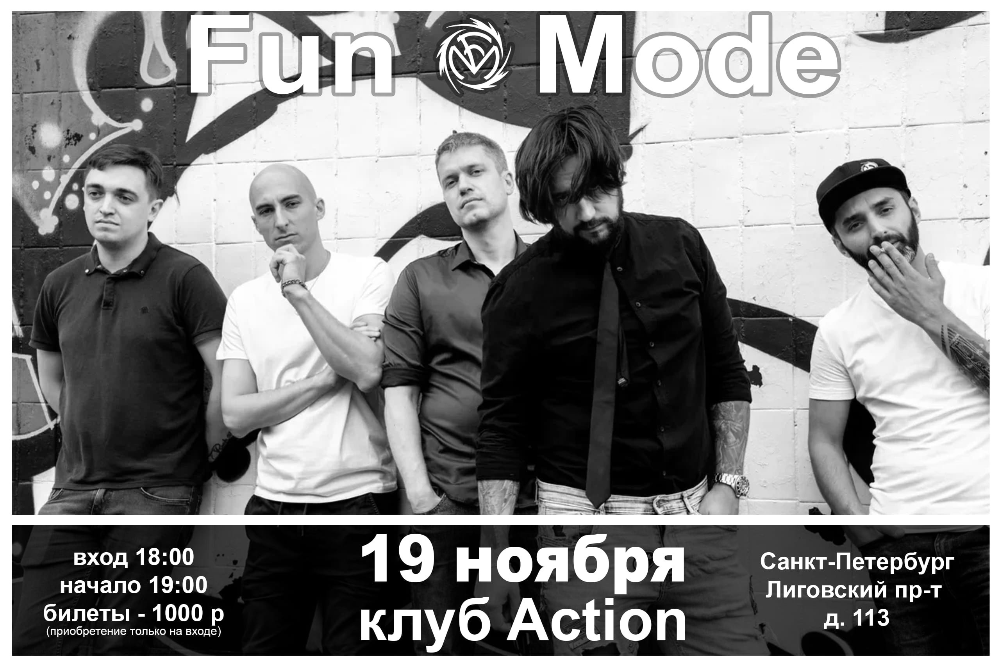
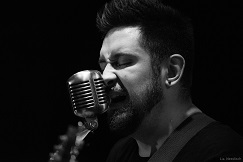

<!DOCTYPE html>
<head>
<meta charset="utf-8">
<title>Fun mode</title>
<link href="css/bootstrap.min.css" rel="stylesheet">
<link href="css/business-casual.css" rel="stylesheet">
</head>
<body>
<nav class="navbar navbar-default" role="navigation">

            

                <ul class="nav navbar-nav">
                    <li>
                        <a href="index.html">Главная</a>
                    </li>
                    <li>
                        <a href="album.html">Альбомы</a>
                    </li>
                    <li>
                        <a href="foto1.html">Фото</a>
                    </li>
                    <li>
                        <a href="video.html">Интервью</a>
                    </li>
                </ul>
            

        

</nav>
    

        

            

                

                    

                        <ol class="carousel-indicators hidden-xs">
                            <li data-target="#carousel-example-generic" data-slide-to="0" class="active"></li>
                            <li data-target="#carousel-example-generic" data-slide-to="1"></li>
                            <li data-target="#carousel-example-generic" data-slide-to="2"></li>
                        </ol>
                        

                            

                                
                            

                            

                                
                            

                            

                                
                            

                        

                        <a class="left carousel-control" href="#carousel-example-generic" data-slide="prev">
                            
                        </a>
                        <a class="right carousel-control" href="#carousel-example-generic" data-slide="next">
                            
                        </a>
                    

                    <h2 class="brand-before">
                        <small>Инфо лента</small>
                    </h2>
                    <h1 class="brand-name">Концерты</h1>
                

            

        

        

            

                

                 
                    <h1 class="intro-text text-center">Иванов Павел  </h1>
                        <h3 class="intro-text text-center">Солист и основатель группы</h3>
                    
                    

                    
Житель Тверской области. Свою  карьеру как композитора начал ещё с 16 лет играю во дворе для друзей. На сегодняшний день он является салистом группы, на их счету уже 8 альбомов, 6 из которых являются тематическими и были написанны для игры World Of Warcraft.

                    
Свой первый "лирический" альбом он записал в 2018 году, и назвал его "Открой глаза". 

                    
Сама идея создать группу была очень спонтанной. Свою первую известность в медиа пространстве Павел получил после публикации Видео на YouTube в 2009 году. Тогда Павел даже не подозревал, что именно после этого видео он через несколько лет уже будет ездить на концерты по стране.

                

            

        

    

    <footer>
        

            

                

                    
Copyright &copy; Matveev 2021 Tver

                

            

        

    </footer>

</body>
</html>
